## Installation:

Usage:  `sudo ./install.sh [OPTIONS...]`

```
  -t, --theme     Background theme variant(s) [changli|jinxi|jiyan|yinlin|anke|weilinai|kakaluo|jianxin|qianxiao|cartethyia|younuo|aemeath|lynae|mornye] (default is changli)
  -s, --screen    Screen display variant(s)   [1080p|2k|4k|auto] (default is 1080p)
  -r, --remove    Remove/Uninstall theme      [changli|jinxi|jiyan|yinlin|anke|weilinai|kakaluo|jianxin|qianxiao|cartethyia|younuo|aemeath|lynae|mornye] (must add theme name option, default is changli)
  -b, --boot      install theme into '/boot/grub' or '/boot/grub2'
  -h, --help      Show this help
```

_If no options are used, a user interface `dialog` will show up instead_

### Examples:
 - Install yinlin theme on 2k display device:

```sh
sudo ./install.sh -t yinlin -s 2k
```

 - Install jinxi theme into /boot/grub/themes:

```sh
sudo ./install.sh -b -t jinxi
```

 - Uninstall yinlin theme:

```sh
sudo ./install.sh -r -t yinlin
```

## Issues / tweaks:

### Correcting display resolution:

 - On the grub screen, press `c` to enter the command line
 - Enter `vbeinfo` or `videoinfo` to check available resolutions
 - Open `/etc/default/grub`, and edit `GRUB_GFXMODE=[width]x[height],auto` to match your resolution
 - Finally, run `grub-mkconfig -o /boot/grub/grub.cfg` to update your grub config

### Setting a custom background:

 - Make sure you have `imagemagick` installed, or at least something that provides `convert`
 - You can use `-s auto` to auto-detect display resolution and center-crop background to fit
 - If you use fixed modes (`1080p`, `2k`, `4k`), background should match that target resolution
   - 1920x1080 >> 1080p
   - 2560x1440 >> 2k
   - 3840x2160 >> 4k
 - Place your custom background inside the root of the project, and name it `background.jpg`
 - Run the installer with `-t [THEME] -s auto` (recommended), or choose a fixed mode with `-s [1080p|2k|4k]`

## Contributing:
 - If you made changes to icons, or added a new one:
   - Delete the existing icon, if there is one
   - Run `cd assets; ./render-all.sh`
 - Create a pull request from your branch or fork
 - If any issues occur, report then to the [issue](issues) page

## Preview:

Generated from real boot simulation (`QEMU + UEFI + GRUB`), then compressed for GitHub display.

### 2560x1440

| changli | jinxi | jiyan | yinlin |
|---|---|---|---|
| 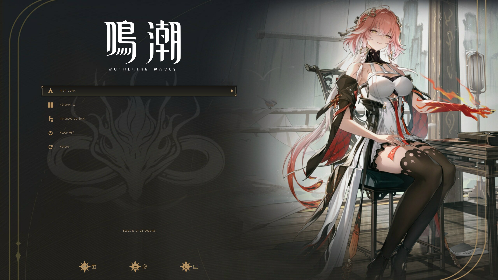 | 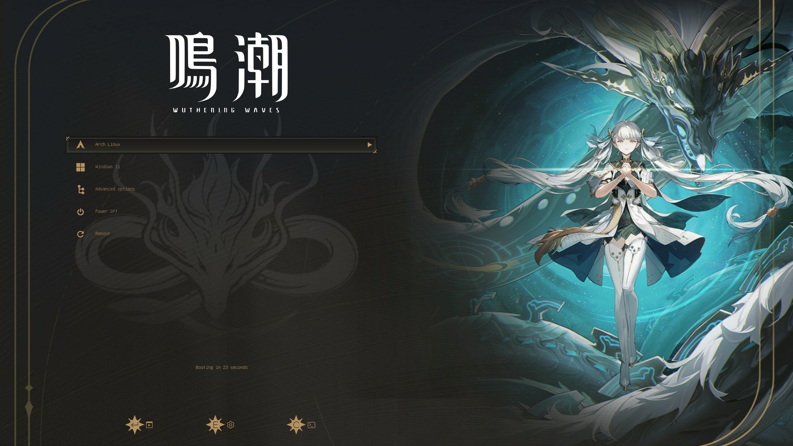 | 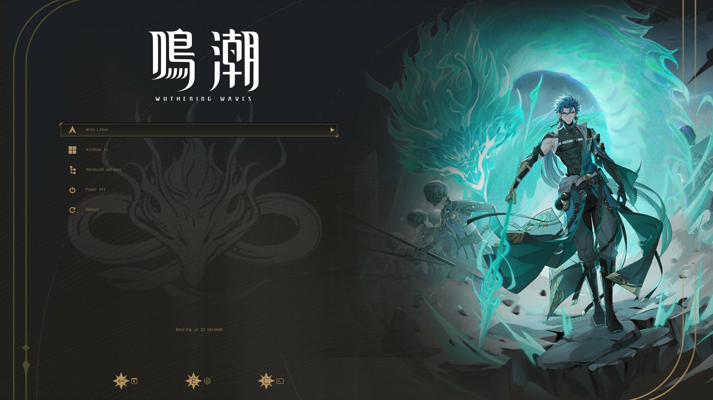 | 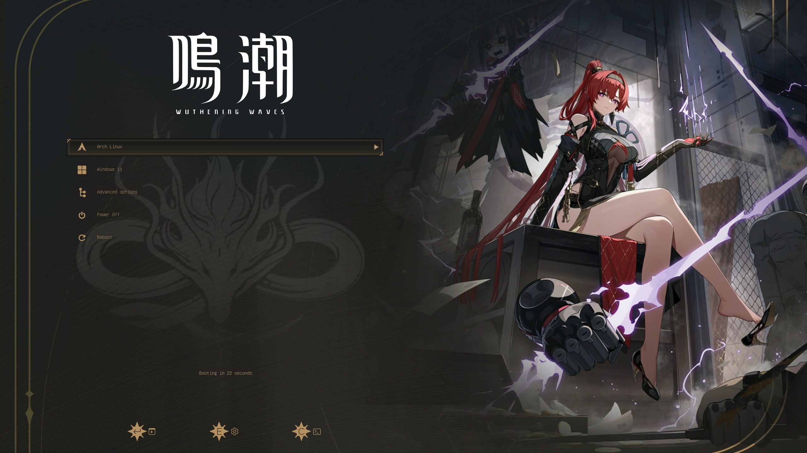 |

| anke | weilinai | kakaluo | jianxin |
|---|---|---|---|
| 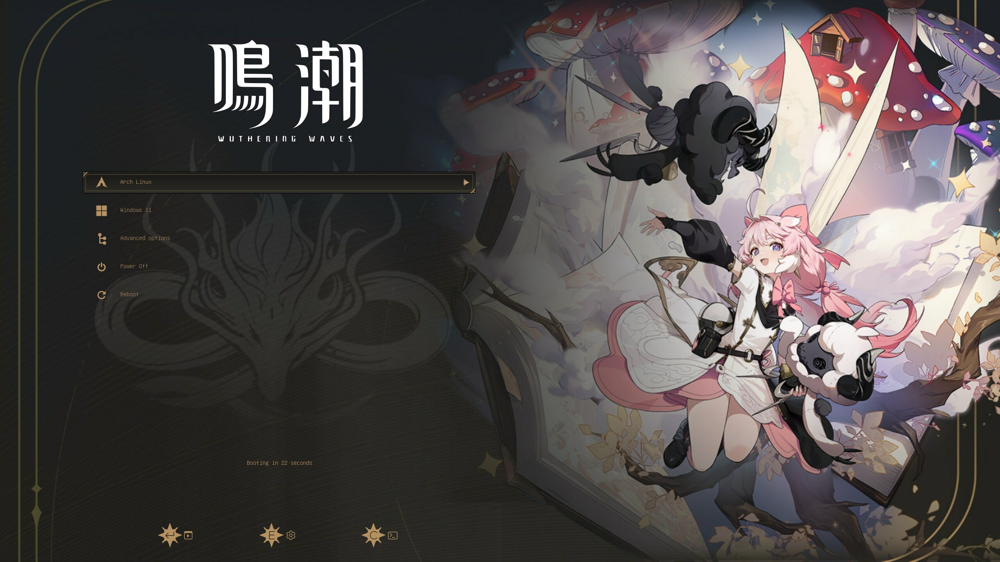 | 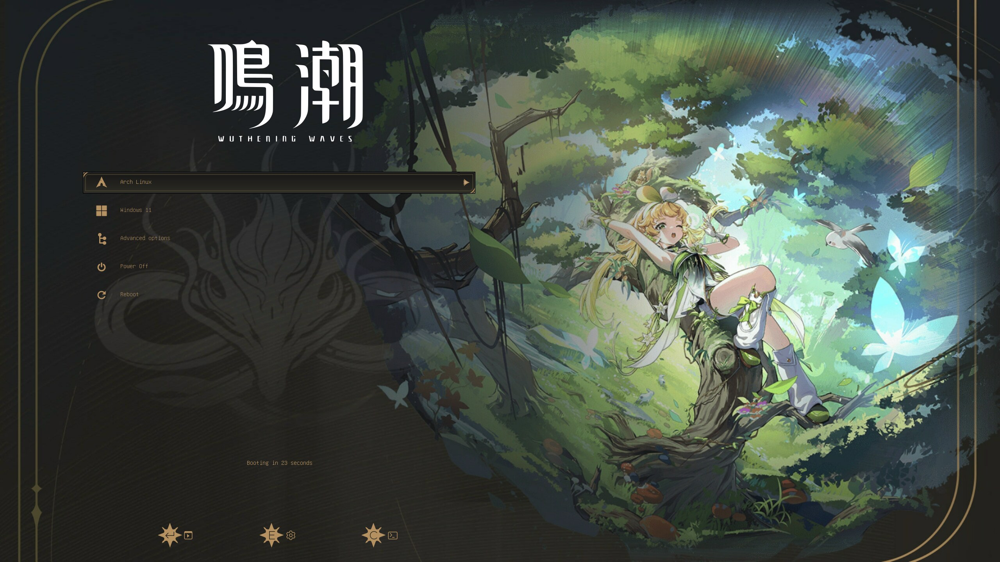 | 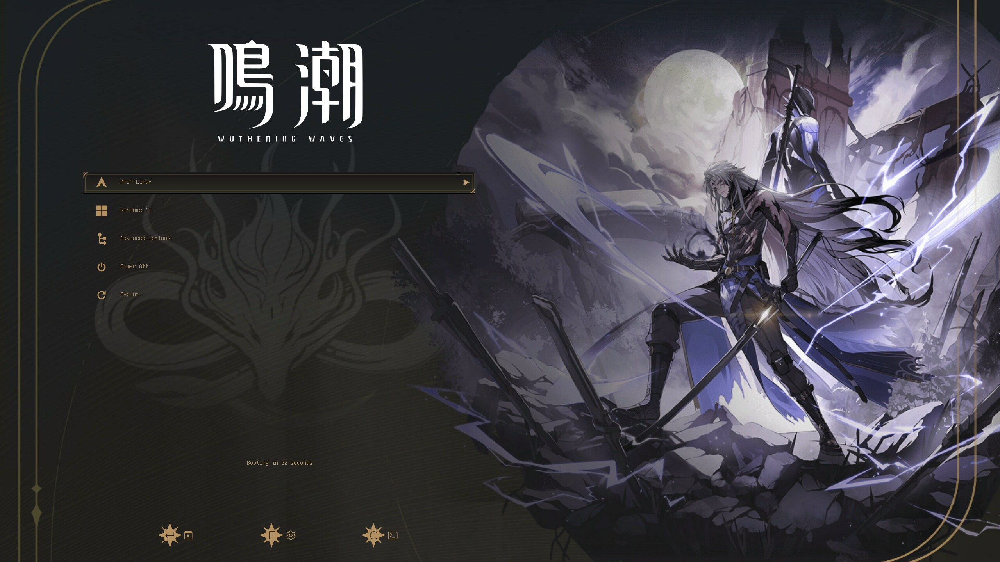 | 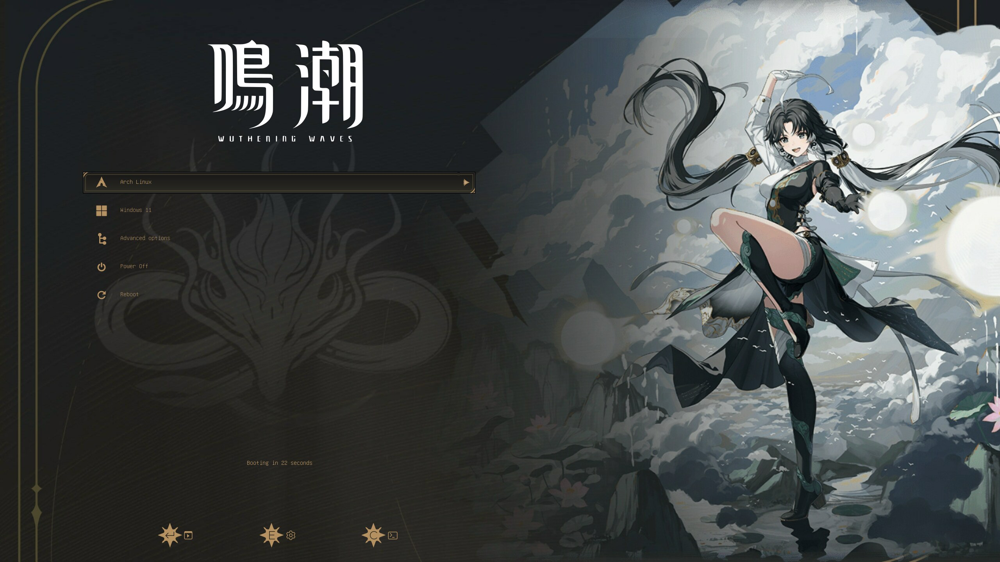 |

### 2560x1600

| qianxiao | cartethyia | younuo |
|---|---|---|
| 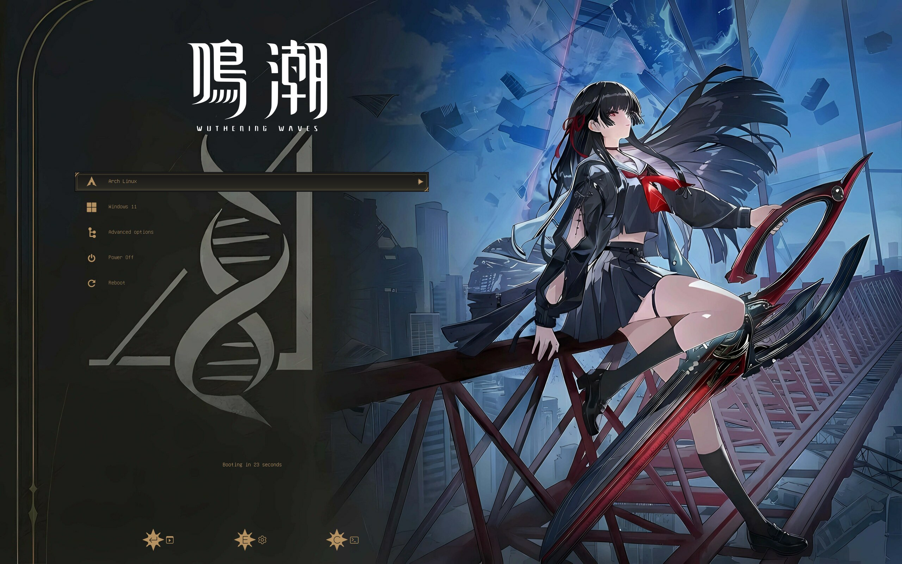 | 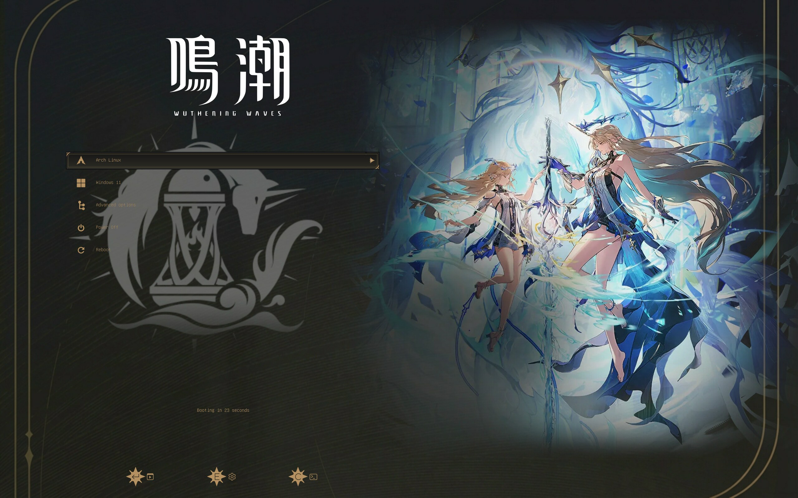 | 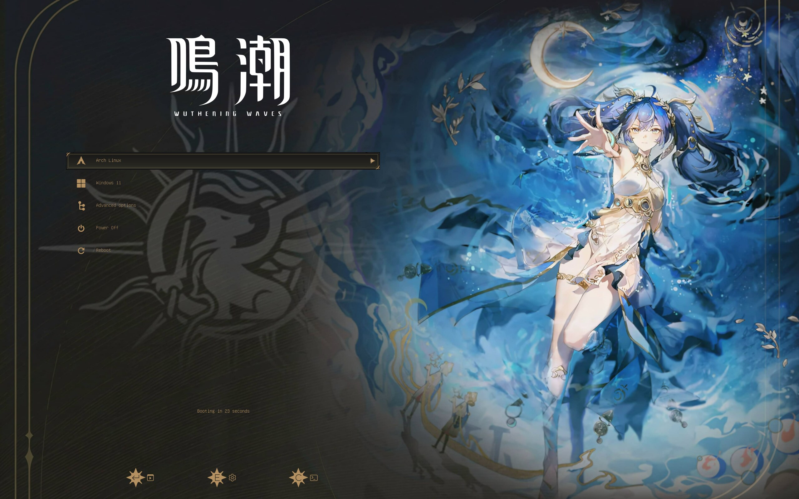 |

| aemeath | lynae | mornye |
|---|---|---|
| 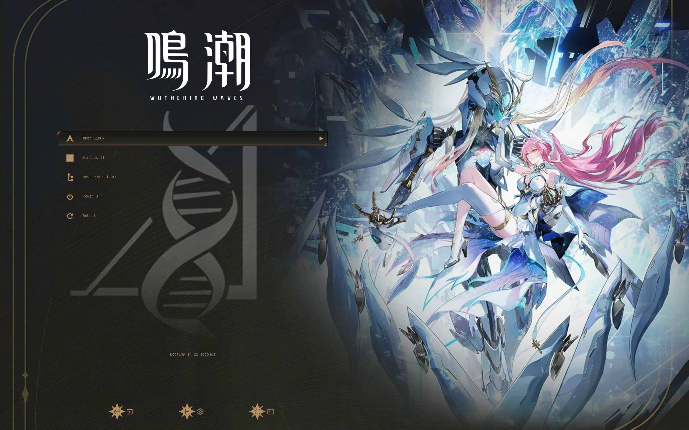 | 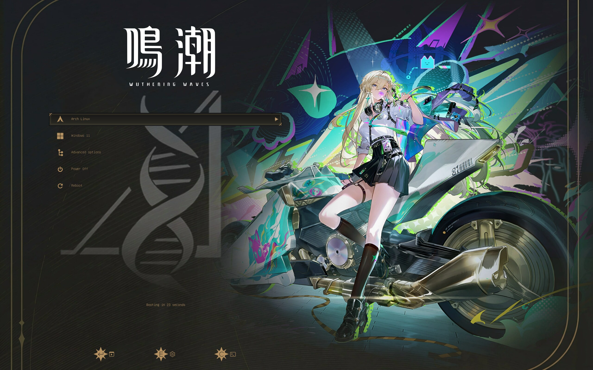 | 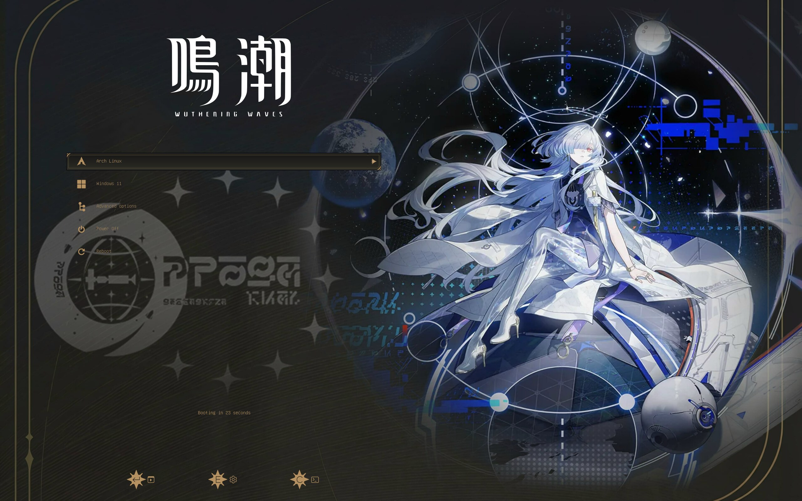 |

## Documents

[Grub2 theme reference](https://wiki.rosalab.ru/en/index.php/Grub2_theme_/_reference)

[Grub2 theme tutorial](https://wiki.rosalab.ru/en/index.php/Grub2_theme_tutorial)
